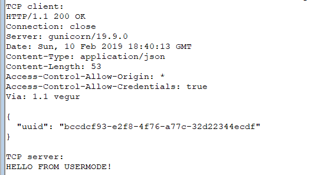

# KSOCKET

**KSOCKET** provides a very basic example on how to make a network connections
in the Windows Driver by using WSK.

### Why?

In my opinion there aren't too much examples on WSK on the Internet.  This is
quite understandable, as generally dealing with networking in the kernel-mode
isn't a very good idea.  However, sometimes, you're just too interested _**how it can be done**_.

### What does it do?

It makes a HTTP GET request to the `httpbin.org/uuid` and prints the response
to the debugger.  Then, it creates a TCP server listening on port 9095 and waits
for a client.  When the client connects, it waits for a single message, prints
it to the debugger and then responds with `Hello from WSK!` and closes both
client and server sockets.

The output in the debugger might look like this:



### Implementation

Because everyone is familiar with the **Berkeley socket API**, I've ported
a very small subset of it - enough to make a basic TCP/UDP client/server:

```c
int getaddrinfo(const char* node, const char* service, const struct addrinfo* hints, struct addrinfo** res);
void freeaddrinfo(struct addrinfo *res);

int socket_connection(int domain, int type, int protocol);
int socket_listen(int domain, int type, int protocol);
int socket_datagram(int domain, int type, int protocol);
int connect(int sockfd, const struct sockaddr* addr, socklen_t addrlen);
int listen(int sockfd, int backlog);
int bind(int sockfd, const struct sockaddr *addr, socklen_t addrlen);
int accept(int sockfd, struct sockaddr *addr, socklen_t *addrlen);
int send(int sockfd, const void* buf, size_t len, int flags);
int sendto(int sockfd, const void *buf, size_t len, int flags, const struct sockaddr *dest_addr, socklen_t addrlen);
int recv(int sockfd, void* buf, size_t len, int flags);
int recvfrom(int sockfd, void *buf, size_t len, int flags, struct sockaddr *src_addr, socklen_t *addrlen);
int closesocket(int sockfd);
```

You can probably see the biggest difference between this API and the original Berkeley
socket API - instead of a single `socket()` function, there are `socket_connection()`,
`socket_listen()` and `socket_datagram()` functions.  This is because in WSK, you
have to specify type of the socket **when** the socket object is created.  Although
it would probably be possible with some workarounds to make just single `socket()` function,
for simplicity of the implementation I've decided to split it too.

> **NOTE:** This project is purely experimental and its goal is to show basic
> usage of the WSK. There aren't many error checks and it is not recommended
> for production use.

### License

This software is open-source under the MIT license. See the LICENSE.txt file in this repository.

Dependencies are licensed by their own licenses.

If you find this project interesting, you can buy me a coffee

```
  BTC 12hwTTPYDbkVqsfpGjrsVa7WpShvQn24ro
  LTC LLDVqnBEMS8Tv7ZF1otcy56HDhkXVVFJDH
```

[wsk-msdn]: <https://docs.microsoft.com/en-us/windows-hardware/drivers/network/introduction-to-winsock-kernel>
[wsk-http]: <https://github.com/reinhardvz/afdmjhk/blob/master/WSK/Samples/wsksample/wsksample.c>
[wsk-echosrv]: <https://github.com/Microsoft/Windows-driver-samples/tree/master/network/wsk/echosrv>
